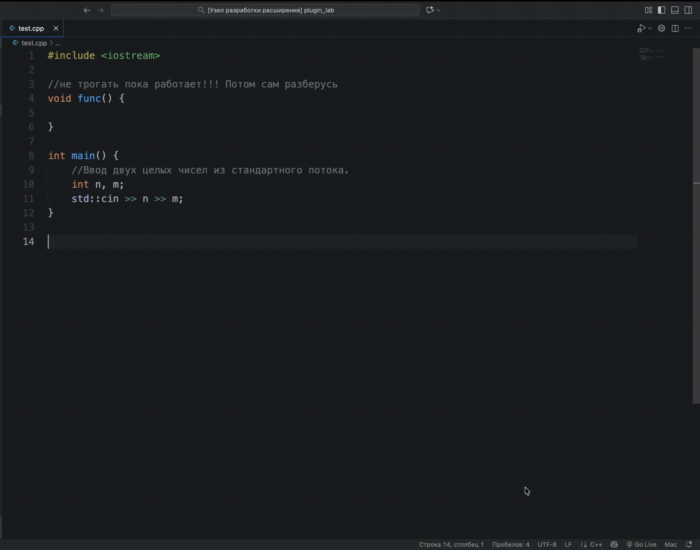

**CommentCorrector v0.0.1**

***

# CommentCorrector

CommentCorrector — расширение VS Code, которое анализирует комментарии в коде и приводит их к строгому корпоративному стилю. Инструмент помогает избавляться от сленга, эмоциональных формулировок и неформальной лексики, сохраняя техническую суть комментариев.

## Основные возможности

- Коррекция комментариев: команда `CommentCorrector: Исправить некорректные комментарии` заменяет проблемные комментарии на формальные эквиваленты.
- Подсветка комментариев: команда `CommentCorrector: Выделить корректные/некорректные комментарии цветом` классифицирует комментарии как формальные или неформальные и подсвечивает их разными цветами.
- Сброс подсветки: команда `CommentCorrector: Отменить выделение комментариев цветом` убирает все активные выделения.



## Требования

- VS Code версии `1.105.0` или новее.
- Доступ к OpenAI-совместимому API (любая модель, поддерживающая Chat Completions API).

## Установка

1. Склонируйте репозиторий и установите зависимости.
   ```bash
   git clone https://github.com/pikmi064/comment-corrector-vscode-plugin
   cd comment-corrector-vscode-plugin
   npm install
   ```
2. Откройте проект в VS Code и соберите расширение.
   ```bash
   npm run compile
   ```

## Настройка окружения

Создайте файл `.env` в корне расширения и укажите параметры API:
```
API_URL=<url_openai_compatible_api>
API_KEY=<your_api_key>
MODEL_NAME=<model_name>
```

**Примеры конфигурации:**

1. **OpenAI API:**
   ```
   API_URL=https://api.openai.com/v1
   API_KEY=sk-...
   MODEL_NAME=gpt-4o-mini
   ```

2. **OpenRouter:**
   ```
   API_URL=https://openrouter.ai/api/v1
   API_KEY=sk-or-...
   MODEL_NAME=openai/gpt-4o-mini
   ```

3. **GitHub Models:**
   ```
   API_URL=https://models.inference.ai.azure.com
   API_KEY=ghp_...
   MODEL_NAME=openai/gpt-4o-mini
   ```

Убедитесь, что используемая модель поддерживает Chat Completions API (стандарт OpenAI).

## Использование

1. Запустите команду `Run Extension` из VS Code (панель `Run and Debug`).
2. В окне расширения откройте файл с кодом.
3. Вызовите нужную команду через `Cmd/Ctrl + Shift + P`:
   - `CommentCorrector: Исправить некорректные комментарии` — автоматически заменит найденные комментарии.
   - `CommentCorrector: Выделить комментарии цветом` — подсветит формальные и неформальные комментарии.
   - `CommentCorrector: Отменить выделение комментариев цветом` — снимет подсветку.

## Раскраска комментариев

- Зелёный цвет — комментарий в формальном стиле.
- Красный цвет — комментарий с неформальной лексикой или тоном.
- Жёлтый цвет — комментарий, для которого не удалось получить классификацию.

## Скрипты npm

- `npm run compile` — компиляция TypeScript в `out/`.
- `npm run docs` — генерация документации из JSDoc комментариев с помощью TypeDoc (результат в папке `docs/`).

## Ограничения

- Поддерживаются только файлы с однострочными комментариями (`//`, `#`, `<!--`, `/*`). Многострочные комментарии не обрабатываются.
- При отсутствии доступа к API корректировка и классификация будут недоступны.

## Автор

**Васильев Данил Александрович**  
ИСУ: 501873  
Группа: М3101
